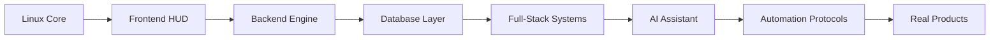
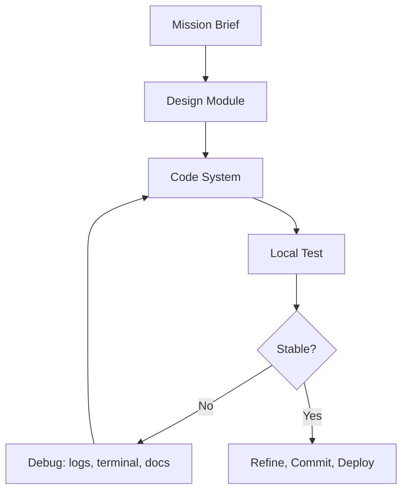

<div align="center">

  

  

  <br />
  <br />

  <a href="https://github.com/Eduarcito">
    
  </a>
  <a href="https://github.com/Eduarcito?tab=followers">
    
  </a>
  <a href="https://github.com/Eduarcito?tab=repositories">
    
  </a>

  <br />
  <br />

  
  
  
  

</div>

---

## ACCESS TERMINAL

```bash
root@classified-node:~$ ssh eduardo@github-core
Establishing encrypted developer session...

[OK] Identity packet verified
[OK] Linux terminal workflow detected
[OK] Full-stack modules initialized
[OK] AI automation lab synchronized
[OK] DSA combat simulator linked

ACCESS GRANTED // WELCOME, OPERATOR
```

```diff
+ NODE: EDUARDO_IRAHETA
+ ROLE: SYSTEMS_ENGINEERING_STUDENT
+ STATUS: FULL_STACK_DEVELOPER_IN_PROGRESS
+ OS_PROFILE: LINUX_MINDED
+ ACTIVE_PROTOCOL: BUILD -> DEBUG -> AUTOMATE -> DEPLOY
+ THREAT_LEVEL: BUGS_DETECTED_AND_BEING_PATCHED
```

---

## IDENTITY PACKET


I am **Eduardo Iraheta**, a **Systems Engineering student at USO**, Linux-minded developer and full-stack builder in progress. This profile is my classified dev server: a place where I track my stack, training modules, AI tools, automation workflows and public build history.

```ts
const operator = {
  codename: "Eduarcito",
  identity: "Eduardo Iraheta",
  role: "Systems Engineering Student",
  operatingMode: "Linux-minded / terminal-first",
  stackPath: "Full-Stack Developer in Progress",
  activeLabs: ["Web Systems", "AI Automation", "Data Workflows", "DSA Training"],
  mission: "Build useful software, understand the system, upgrade continuously"
};
```

- Building stronger foundations in **frontend**, **backend**, **databases**, **Linux workflows**, and **software architecture**.
- Exploring **Codex**, **Firecrawl**, **ElevenLabs**, **n8n**, **Supabase**, and **Data MCP**.
- Training problem-solving logic through **DSA**, **LeetCode**, SQL thinking and debugging discipline.
- Learning by shipping real projects, breaking things, reading errors and upgrading the system.

<br clear="right" />

---

## CORE SYSTEMS

<div align="center">

  

  <br />
  <br />

  
  
  
  

</div>

| System Layer | Active Modules |
| --- | --- |
| **Interface Layer** | HTML, CSS, JavaScript, React, Bootstrap, Tailwind CSS |
| **Engine Layer** | Node.js, Java, Maven, API logic, backend foundations |
| **Data Layer** | MySQL, Supabase, SQL practice, structured workflows |
| **Linux Layer** | Terminal workflow, Bash basics, Git, local environments |
| **Automation Layer** | Codex, Firecrawl, ElevenLabs, n8n, Data MCP |

---

## CLASSIFIED DASHBOARD

<table>
  <tr>
    <td width="25%" align="center">
      <strong>HUD Interface</strong>
      <br />
      Responsive UIs, reusable components and polished experiences.
    </td>
    <td width="25%" align="center">
      <strong>Engine Core</strong>
      <br />
      APIs, authentication, backend logic and system foundations.
    </td>
    <td width="25%" align="center">
      <strong>Neural Tools</strong>
      <br />
      AI-assisted coding, automation chains and research workflows.
    </td>
    <td width="25%" align="center">
      <strong>Data Scanner</strong>
      <br />
      SQL, Supabase, structured data and MCP-connected workflows.
    </td>
  </tr>
</table>

```txt
SYSTEM MAP
├─ /interface        React + CSS + responsive design
├─ /engine           Node.js + Java + API logic
├─ /database         MySQL + Supabase + SQL workflows
├─ /linux            terminal + Bash + Git + local dev
├─ /ai-lab           Codex + Firecrawl + ElevenLabs + n8n
└─ /training         DSA + LeetCode + debugging discipline
```

---

## DSA COMBAT SIMULATOR

<div align="center">

  
  
  

  <br />
  <br />

  <a href="https://leetcode.com/Eduarcito">
    
  </a>

</div>

| Training Module | Current Objective |
| --- | --- |
| **Arrays & Strings** | Pattern recognition and implementation speed |
| **Hash Maps & Sets** | Lookup logic, counting, grouping and frequency tracking |
| **Recursion & Backtracking** | Breaking problems into controlled decision trees |
| **SQL + Data Thinking** | Connecting algorithmic thinking with real data workflows |

---

## AI AUTOMATION LAB

<div align="center">

  
  
  
  
  
  

</div>

```bash
ai-lab@classified-node:~$ run modules --status
codex        -> code acceleration, refactors, debugging support
firecrawl    -> web research, extraction, structured knowledge
elevenlabs   -> voice AI experiments and audio experiences
n8n          -> automation flows and connected workflows
supabase     -> data apps, auth-ready backend experiments
data_mcp     -> data-connected tool workflows
```

---

## UPGRADE PATH



---

## TELEMETRY

<div align="center">

  
  

  <br />
  <br />

  

  <br />
  <br />

  

</div>

---

## PROFILE SUMMARY CARDS

<div align="center">

  
  <br />
  <br />
  
  

</div>

---

## BUILD PROTOCOL



| Protocol | Meaning |
| --- | --- |
| **Prototype Fast** | Real projects reveal what theory alone cannot show. |
| **Understand the Machine** | Know what happens under the UI, inside the API, and behind the terminal. |
| **Keep the Code Clean** | Readable code is maintainable code. |
| **Debug Like an Engineer** | Logs, errors and tests are system signals, not obstacles. |
| **Automate the Repetitive** | Scripts, AI and workflows multiply strong fundamentals. |

---

## ACHIEVEMENT VAULT

<div align="center">

  

</div>

---

## CONNECTION PORT

<div align="center">

  <a href="https://github.com/Eduarcito">
    
  </a>
  <a href="https://github.com/Eduarcito?tab=repositories">
    
  </a>

  <br />
  <br />

  <strong>SESSION STATUS: ACTIVE</strong>
  <br />
  <span>Build. Debug. Automate. Deploy. Upgrade.</span>

</div>


