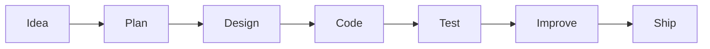

<div align="center">

  

  <a href="https://github.com/Eduarcito">
    
  </a>
  <a href="https://github.com/Eduarcito?tab=followers">
    
  </a>
  <a href="https://github.com/Eduarcito?tab=repositories">
    
  </a>

  <br />
  <br />

  

  <br />
  <br />

  
  
  

</div>

---

## About Me


Hi, I'm **Eduardo Iraheta**, a **Systems Engineering student at USO** and a developer in progress. I enjoy learning by building real projects, solving problems with code, and exploring tools that make software faster, smarter, and more useful.

```ts
const eduardo = {
  role: "Systems Engineering Student",
  focus: ["Web Development", "Databases", "AI Tools", "Automation"],
  mindset: "Learn deeply, build consistently, improve every day",
  currentGoal: "Become a strong full-stack developer"
};
```

- I am strengthening my foundations in **frontend**, **backend**, **databases**, and **software architecture**.
- I like building clean interfaces, useful systems, and practical developer workflows.
- I am exploring **AI-assisted development**, **automation**, **voice AI**, and **data-connected tools**.
- I believe consistency beats intensity, especially when learning to code.

<br clear="right" />

---

## Developer Toolkit

<div align="center">

  

  <br />
  <br />

  
  
  
  
  
  

</div>

---

## What I Build With

<table>
  <tr>
    <td width="33%">
      <h3 align="center">Frontend</h3>
      <p align="center">Responsive interfaces, clean layouts, reusable components, and user-friendly experiences.</p>
    </td>
    <td width="33%">
      <h3 align="center">Backend</h3>
      <p align="center">APIs, server logic, databases, authentication flows, and real-world system foundations.</p>
    </td>
    <td width="33%">
      <h3 align="center">AI & Automation</h3>
      <p align="center">Codex workflows, Firecrawl research, n8n automations, ElevenLabs voice tools, and Data MCP integrations.</p>
    </td>
  </tr>
</table>

---

## Current Focus

| Area | What I am improving |
| --- | --- |
| **Web Development** | Building better interfaces with HTML, CSS, JavaScript, React, Bootstrap, and Tailwind CSS |
| **Backend Logic** | Working with Node.js, Java, APIs, and structured project architecture |
| **Databases** | Practicing with MySQL and Supabase for data-driven applications |
| **AI Workflows** | Using Codex, Firecrawl, ElevenLabs, n8n, and Data MCP to explore modern developer productivity |
| **Engineering Habits** | Writing cleaner code, organizing projects, and learning through consistent commits |

---

## Developer Workflow



---

## GitHub Analytics

<div align="center">

  
  

  <br />
  <br />

  

  <br />
  <br />

  

</div>

---

## Achievements

<div align="center">

  

</div>

---

## Dev Quote

<div align="center">

  

</div>

---

## Connect With Me

<div align="center">

  <a href="https://github.com/Eduarcito">
    
  </a>
  <a href="https://github.com/Eduarcito?tab=repositories">
    
  </a>

  <br />
  <br />

  <strong>Thanks for visiting my profile.</strong>
  <br />
  <span>Always learning, always building, always improving.</span>

</div>


