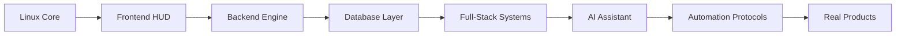
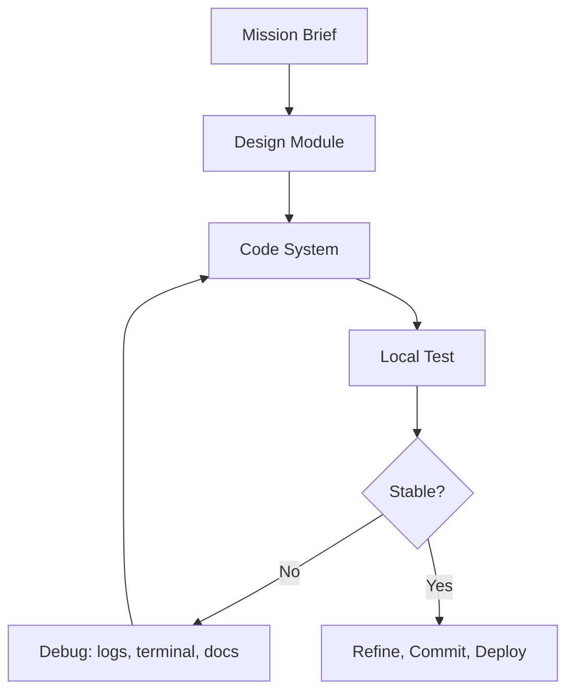

<div align="center">

  

  <a href="https://github.com/Eduarcito">
    
  </a>
  <a href="https://github.com/Eduarcito?tab=followers">
    
  </a>
  <a href="https://github.com/Eduarcito?tab=repositories">
    
  </a>

  <br />
  <br />

  

  <br />
  <br />

  
  
  
  
  

</div>

---

## Profile Elevation Protocol

<div align="center">

  
  
  

  <br />
  <br />

  <a href="https://leetcode.com/Eduarcito">
    
  </a>

</div>

```bash
profile@github:~$ elevate --with dsa --theme dark
[OK] GitHub README upgraded
[OK] LeetCode module connected
[OK] Linux terminal aesthetic enabled
[OK] Developer signal boosted
```

---

## About Me


Hi, I'm **Eduardo Iraheta**, a **Systems Engineering student at USO**, Linux user and developer in progress. I like turning ideas into useful software, learning through real projects, and experimenting with modern tools that connect web development, automation, AI and data.

```ts
const eduardo = {
  role: "Systems Engineering Student",
  path: "Full-Stack Developer in Progress",
  os: "Linux-minded workflow",
  interests: ["Web Apps", "Databases", "AI Tools", "Automation", "Data Workflows"],
  currentlyBuilding: "Projects that mix clean UI, useful logic and smart workflows",
  mindset: "Stay curious, build consistently, improve with every commit"
};
```

- I am building stronger foundations in **frontend**, **backend**, **databases**, **Linux workflows**, and **software architecture**.
- I enjoy creating interfaces that feel clean, responsive and practical.
- I am exploring **Codex**, **Firecrawl**, **ElevenLabs**, **n8n**, **Supabase**, and **Data MCP** for modern developer workflows.
- I care about writing code that is organized, readable and useful in the real world.

<br clear="right" />

---

## Terminal Snapshot

```bash
eduardo@linux-lab:~$ ./boot-hud.sh
[OK] Developer core initialized
[OK] Linux terminal workflow online
[OK] Full-stack modules loaded
[OK] AI automation lab connected

eduardo@linux-lab:~$ scan --current-focus
React | Node.js | Java | MySQL | Supabase | Codex | n8n

eduardo@linux-lab:~$ mission
Build useful systems, automate smart workflows, keep upgrading.

eduardo@linux-lab:~$ status
Learning: ACTIVE | Debugging: ALWAYS | Shipping: IN PROGRESS
```

```diff
+ SYSTEM READOUT
+ public_profile: online
+ leetcode_stats: connected
+ linux_workflow: active
+ automation_lab: charging
+ next_upgrade: stronger projects + cleaner architecture
```

---

## Arc Reactor Core

<div align="center">

  
  
  
  

</div>

| Core Layer | Current Power |
| --- | --- |
| **Operating System Mindset** | Linux workflows, terminal navigation, Bash basics and system thinking |
| **Interface Layer** | React, JavaScript, Tailwind CSS, Bootstrap and responsive UI |
| **Logic Layer** | Node.js, Java, APIs, authentication and backend foundations |
| **Data Layer** | MySQL, Supabase, structured data and MCP-connected workflows |
| **Automation Layer** | Codex, Firecrawl, n8n, ElevenLabs and AI-assisted development |

---

## Developer Command Center

<div align="center">

  

  <br />
  <br />

  
  
  
  
  
  
  
  
  

</div>

---

## Linux Workstation Mindset

<table>
  <tr>
    <td width="25%" align="center">
      <strong>Terminal</strong>
      <br />
      I like command-line workflows, fast navigation and developer tooling.
    </td>
    <td width="25%" align="center">
      <strong>Git</strong>
      <br />
      Version control, commits, branches and learning through real project history.
    </td>
    <td width="25%" align="center">
      <strong>Automation</strong>
      <br />
      Scripts, n8n flows, AI-assisted tasks and repeatable processes.
    </td>
    <td width="25%" align="center">
      <strong>Systems</strong>
      <br />
      Understanding how software, OS tools, servers and data connect.
    </td>
  </tr>
</table>

```bash
# My kind of developer environment
editor="VS Code"
shell="Bash / terminal workflow"
version_control="Git + GitHub"
learning_style="Build projects, break things, debug, repeat"
```

---

## Suit Modules

<table>
  <tr>
    <td width="25%">
      <h3 align="center">HUD Interface</h3>
      <p align="center">Responsive UIs, reusable components and polished user experiences.</p>
    </td>
    <td width="25%">
      <h3 align="center">Power Core</h3>
      <p align="center">APIs, server logic, authentication flows and backend systems.</p>
    </td>
    <td width="25%">
      <h3 align="center">AI Assistant</h3>
      <p align="center">AI-assisted development, automation chains, web research and voice tools.</p>
    </td>
    <td width="25%">
      <h3 align="center">Data Scanner</h3>
      <p align="center">SQL practice, Supabase projects and MCP-connected workflows.</p>
    </td>
  </tr>
</table>

---

## System Diagnostics

```txt
DEVELOPER PROFILE
├─ Identity: Systems Engineering Student
├─ OS Mode: Linux-minded / terminal-first
├─ Main Stack: HTML, CSS, JavaScript, React, Node.js, Java
├─ Database Layer: MySQL, Supabase
├─ AI Lab: Codex, Firecrawl, ElevenLabs, n8n, Data MCP
├─ Build Style: Learn by shipping real projects
└─ Current State: Upgrading daily
```

---

## DSA Combat HUD

<div align="center">

  
  
  

</div>

| Training Module | Current Objective |
| --- | --- |
| **Arrays & Strings** | Improve pattern recognition and implementation speed |
| **Hash Maps & Sets** | Build stronger lookup and frequency-counting logic |
| **Recursion & Backtracking** | Practice breaking big problems into small decisions |
| **SQL + Data Thinking** | Connect problem solving with real data workflows |

---

## Current Focus

| Area | What I am improving |
| --- | --- |
| **Modern Frontend** | HTML, CSS, JavaScript, React, Bootstrap, Tailwind CSS and responsive UI design |
| **Backend Foundations** | Node.js, Java, API design, authentication, clean project structure and real system logic |
| **Databases** | MySQL and Supabase for data-driven apps, CRUD flows and practical database design |
| **Linux Skills** | Terminal workflow, Git, shell basics, local environments and developer productivity |
| **AI + Automation** | Codex, Firecrawl, ElevenLabs, n8n and Data MCP for smarter development workflows |
| **Engineering Habits** | Cleaner commits, better organization, debugging discipline and continuous learning |

---

## Tools I Reach For

```txt
OS / Workflow   Linux mindset, terminal, Bash, Git
Frontend        HTML, CSS, JavaScript, React, Bootstrap, Tailwind CSS
Backend         Node.js, Java, Maven, API logic
Data            MySQL, Supabase, structured workflows
AI / Automation Codex, Firecrawl, ElevenLabs, n8n, Data MCP
Practice        Build projects, read errors, debug, improve
```

<div align="center">

  
  
  
  
  

</div>

---

## AI & Automation Stack

<table>
  <tr>
    <td width="20%" align="center">
      <strong>Codex</strong>
      <br />
      Code help, refactors and project acceleration.
    </td>
    <td width="20%" align="center">
      <strong>Firecrawl</strong>
      <br />
      Web research, extraction and structured information.
    </td>
    <td width="20%" align="center">
      <strong>ElevenLabs</strong>
      <br />
      Voice AI experiments and audio experiences.
    </td>
    <td width="20%" align="center">
      <strong>n8n</strong>
      <br />
      Automation flows and connected app workflows.
    </td>
    <td width="20%" align="center">
      <strong>Data MCP</strong>
      <br />
      Data access patterns and tool-connected workflows.
    </td>
  </tr>
</table>

---

## Upgrade Path



---

## Featured Repositories

<div align="center">

  <a href="https://github.com/Eduarcito/Eduarcito">
    
  </a>

</div>

---

## GitHub Analytics

<div align="center">

  
  

  <br />
  <br />

  

  <br />
  <br />

  

</div>

---

## Profile Summary

<div align="center">

  
  <br />
  <br />
  
  

</div>

---

## Achievements

<div align="center">

  

</div>

---

## Engineering Protocols

| Principle | Meaning |
| --- | --- |
| **Prototype Fast** | Real projects reveal what theory alone cannot show. |
| **Understand the Machine** | Know what happens under the UI, inside the API, and behind the terminal. |
| **Keep the Code Clean** | Readable code is maintainable code. |
| **Debug Like an Engineer** | Logs, errors and tests are system signals, not obstacles. |
| **Automate the Repetitive** | Scripts, AI and workflows multiply strong fundamentals. |

---

## Build Protocol



---

## Dev Quote

<div align="center">

  

</div>

---

## Connect With Me

<div align="center">

  <a href="https://github.com/Eduarcito">
    
  </a>
  <a href="https://github.com/Eduarcito?tab=repositories">
    
  </a>

  <br />
  <br />

  <strong>Thanks for visiting my profile.</strong>
  <br />
  <span>Always learning, always building, always improving.</span>

</div>


